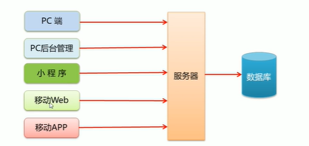
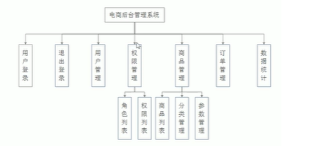
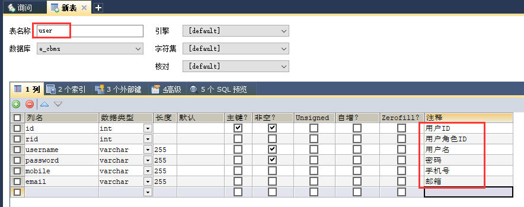
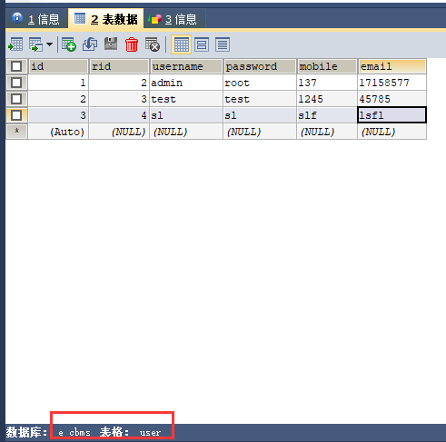
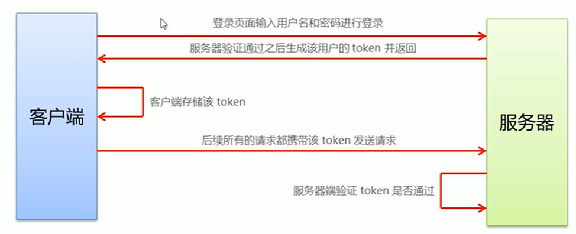
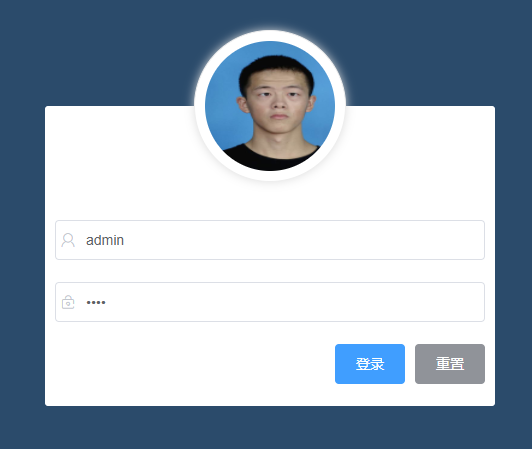

# VUE 项目（电商后台管理系统E_cbms）

## target （目标）

### 掌握基于VUE 如何初始化项目

### 掌握基于VUE 技术栈进行项目开发

### 掌握使用VUE 的第三方组件进行项目开发

### 理解前后端分离的开发模式

## 项目概述

### 电商后台管理系统的多种终端访问方式

* PC端
* 移动APP
* 移动Web
* 微信小程序
* 

### 电商后台管理系统的功能

* 管理用户账号
* 商品分类管理
* 商品信息管理
* 订单管理
* 数据统计
* 

### 电商后台管理系统的开发模式（前后端分离）

* 前端项目是基于VUE技术栈的SPA项目（单页面应用程序）: 绘制页面和调用API接口
* 后端项目负责操作数据库，为前端项目暴露一些外部API接口
* 前后端分离的开发模式：后端写接口，前端调接口的开发模式，主流的开发模式

### 电商后台管理系统的技术栈

* 前端项目技术栈：Vue 、Vue-router、Element-UI、Axios、Echarts
* 后端项目技术栈：Node.js  Express   Jwt  Mysql   Sequelize

##项目初始化

### 前端项目初始化步骤

* [安装VUE 脚手架](https://blog.csdn.net/yk_ddm/article/details/115007140?spm=1001.2014.3001.5501)
* [通过 VUE 脚手架创建项目](https://blog.csdn.net/yk_ddm/article/details/115007245?spm=1001.2014.3001.5501)
* [配置VUE 路由](https://blog.csdn.net/yk_ddm/article/details/115007269?spm=1001.2014.3001.5501)
* [配置Element-UI 组件库](https://blog.csdn.net/yk_ddm/article/details/115006632?spm=1001.2014.3001.5501)
* [配置Axios 库](https://blog.csdn.net/yk_ddm/article/details/115006708?spm=1001.2014.3001.5501)
* 初始化 git 远程仓库
* 本地项目托管到码云或github

### 后台项目的环境安装配置

* 安装MySql 数据库
  * E_cbms 数据库
* 安装 Node.js 环境
* 配置项目的相关信息（依赖包）
* 启动项目
* 使用Postman 测试后台项目接口是否正常（==todo==）

### 详细的数据库设计图

* 创建表
  * user 用户表的创建
    * 
    * 
  * s f

## 登录、退出功能

### 登录概述

* 登录流程
  * 登录页面输入用户名和密码
  * 点击登录按钮调用后台接口进行验证
  * 后台接口会返回验证结果（成功或失败）
    * 失败： 前端提示用户登录失败
    * 成功：根据响应状态，跳转到项目主页
* 登录业务涉及的相关技术
  * http （无状态）
  * 客户端 cookie 的使用（当没有跨域问题时使用）
  * 服务端 session 的使用（当没有跨域问题时使用）
  * token （当存在跨域问题时，可以使用）
    * 由服务器端生成 token 值返回给客户端浏览器，然后存储
    * 后续的一系列请求都携带token发送请求，服务端验证token是否通过
    * 

### 登录功能的实现

* 登录页面的布局
  * 使用到 Element-UI 组件实现布局
  * el - form
  * el - form - item
  * el - input
  * el - button
  * 字体图标
* 效果图
* 
* 

## 主页布局

## 用户管理模块

## 权限管理模块

## 分类管理模块

## 参数管理模块

## 商品管理模块

## 订单管理模块

## 数据统计模块

